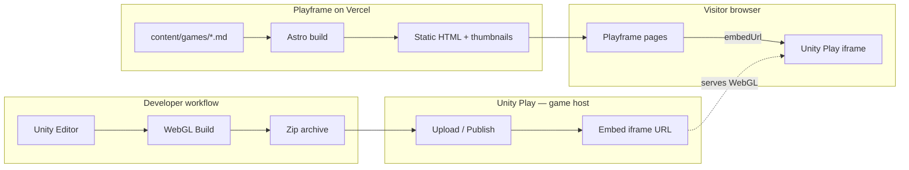

# Architecture overview

Playframe is a **static Astro site on Vercel**. It does not run game logic or host WebGL binaries — Unity Play serves the game runtime inside an iframe.

---

## System context



**Key point:** WebGL files never touch Vercel. Only metadata, thumbnails, and an iframe tag.

---

## Repository layout (target)

```
/
├── docs/
├── public/
│   ├── favicon.svg
│   └── images/
├── src/
│   ├── components/
│   │   ├── GameCard.astro
│   │   ├── GameGrid.astro
│   │   ├── UnityPlayEmbed.astro   # iframe wrapper
│   │   ├── Header.astro
│   │   └── Footer.astro
│   ├── layouts/
│   │   ├── BaseLayout.astro       # dark theme shell
│   │   └── GameLayout.astro
│   ├── pages/
│   │   ├── index.astro
│   │   ├── about.astro
│   │   └── games/[slug].astro
│   ├── content/config.ts
│   └── styles/global.css            # dark theme tokens
├── content/games/
└── astro.config.mjs
```

---

## Page routing

| Route | Source | Description |
|-------|--------|-------------|
| `/` | `src/pages/index.astro` | Dark-themed game card grid |
| `/games/[slug]` | `src/pages/games/[slug].astro` | Game detail + Unity Play embed |
| `/about` | `src/pages/about.astro` | About the creator |
| `/404` | `src/pages/404.astro` | Not found |

---

## Component responsibilities

### `UnityPlayEmbed.astro`

Primary playback component on game detail pages:

- Responsive 16:9 iframe wrapper
- `src` from game's `embedUrl`
- `allow="autoplay; fullscreen; vr"`
- Lazy-load or click-to-play for performance
- **Play poster** — game `thumbnail` as a full-bleed cover with gradient overlay and play CTA (Playframe UI, not Unity Play)
- **Fullscreen toggle** — expands the embed container via the browser Fullscreen API (not Unity `postMessage`; third-party sites cannot drive Unity Play's internal fullscreen commands)
- Fallback: "Having trouble? Open on Unity Play ↗"

### `GameCard.astro`

Thumbnail card on home grid. Links to detail page (where embed lives). No iframe on home.

---

## External dependencies

| Service | Role | Failure mode |
|---------|------|--------------|
| Unity Play | Hosts WebGL + serves iframe player | Show fallback link |
| Vercel | Serves static site | Standard CDN outage |
| Git | Source + deploy trigger | Cannot deploy until restored |

---

## Performance notes

- **Home:** no iframes → target Lighthouse 95+
- **Game detail:** embed is heavy; lazy-load iframe or load on "Play" click
- **Vercel:** only static assets — well within free tier limits
- **Thumbnails:** Astro image optimization, WebP

---

## Security

- Only embed URLs from `play.unity3dusercontent.com`
- Only link to `play.unity.com` for fallback
- No user input on v1

See [Unity Play embed research](../research/unity-play-embed-research.md) for full analysis.
