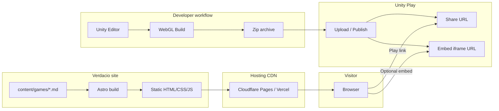

# Architecture overview

Verdacio is a **static site** built with Astro. It does not run game logic or host WebGL binaries — Unity Play handles that. Verdacio is the catalog and front door.

---

## System context



---

## Repository layout (target)

```
/
├── docs/                       # This documentation
├── public/
│   ├── favicon.svg
│   └── images/                 # Shared static assets
├── src/
│   ├── components/
│   │   ├── GameCard.astro
│   │   ├── GameGrid.astro
│   │   ├── UnityPlayEmbed.astro
│   │   ├── Header.astro
│   │   └── Footer.astro
│   ├── layouts/
│   │   ├── BaseLayout.astro
│   │   └── GameLayout.astro
│   ├── pages/
│   │   ├── index.astro         # Home — game grid
│   │   ├── about.astro
│   │   └── games/
│   │       └── [slug].astro    # Dynamic game detail
│   ├── content/
│   │   └── config.ts           # Content Collection schema (Zod)
│   └── styles/
│       └── global.css
├── content/
│   └── games/                  # Game markdown files
│       └── _example-game.md
├── astro.config.mjs
├── package.json
└── tsconfig.json
```

---

## Page routing

| Route | Source | Description |
|-------|--------|-------------|
| `/` | `src/pages/index.astro` | Lists all `status: released` games |
| `/games/[slug]` | `src/pages/games/[slug].astro` | Single game detail |
| `/about` | `src/pages/about.astro` | About the creator |
| `/404` | `src/pages/404.astro` | Not found |

`getStaticPaths()` generates one static page per game at build time.

---

## Component responsibilities

### `GameCard.astro`

Renders a single game in the home grid. Props: game metadata. Links to `/games/[slug]`.

### `GameGrid.astro`

Maps over the games collection, sorts by `releasedAt` descending, renders `GameCard` for each.

### `UnityPlayEmbed.astro`

Renders an iframe when `embedUrl` is present. Includes:
- Responsive 16:9 wrapper
- `allow="autoplay; fullscreen"` attributes
- Fallback link: "Having trouble? Play on Unity Play"

### `BaseLayout.astro`

HTML shell: `<head>` meta, header nav, footer, global styles.

### `GameLayout.astro`

Extends `BaseLayout` with game-specific Open Graph tags and breadcrumb.

---

## Content pipeline

1. Markdown files in `content/games/` are loaded by Astro Content Collections
2. `src/content/config.ts` defines a Zod schema — invalid entries fail the build
3. At build time, pages are generated as static HTML
4. No runtime database or API calls

---

## External dependencies

| Service | Role | Failure mode |
|---------|------|--------------|
| Unity Play | Hosts and runs WebGL games | Play button opens Unity Play; embed shows fallback message |
| Hosting CDN | Serves static site | Standard CDN outage — nothing site-specific to do |
| Git provider | Source + deploy trigger | Cannot deploy until restored |

---

## Security considerations

- No user input on v1 — no XSS surface from forms
- iframe `sandbox` is **not** recommended (breaks Unity WebGL); use Unity's official embed URL only
- Only link to `play.unity.com` and `play.unity3dusercontent.com` domains
- Dependencies: keep Astro and packages updated via Dependabot

---

## Performance notes

- Home page: no iframes, no client JS required → target Lighthouse 95+
- Game detail with embed: WebGL is heavy; lazy-load iframe (`loading="lazy"`) or load on "Play inline" button click
- Images: use Astro image optimization for thumbnails; WebP where possible
- Fonts: self-host or use system font stack to avoid render-blocking third-party requests

---

## Future extension points

| Feature | Approach |
|---------|----------|
| Tag filter | Client island or query-param filtered static pages |
| Blog | Second Content Collection `content/posts/` |
| CMS | Replace git content with Sanity/etc. at build time |
| Self-hosted WebGL | Add `playMode: "self-hosted"` field + static files in `public/games/` |
